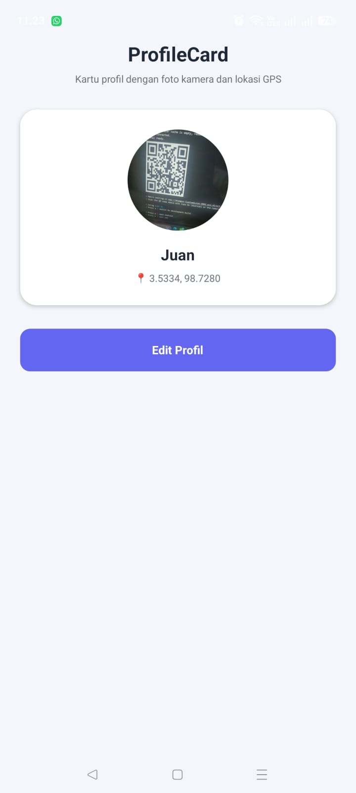
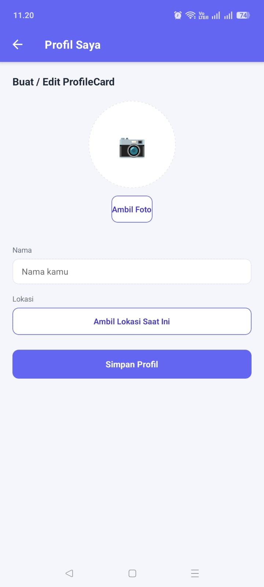
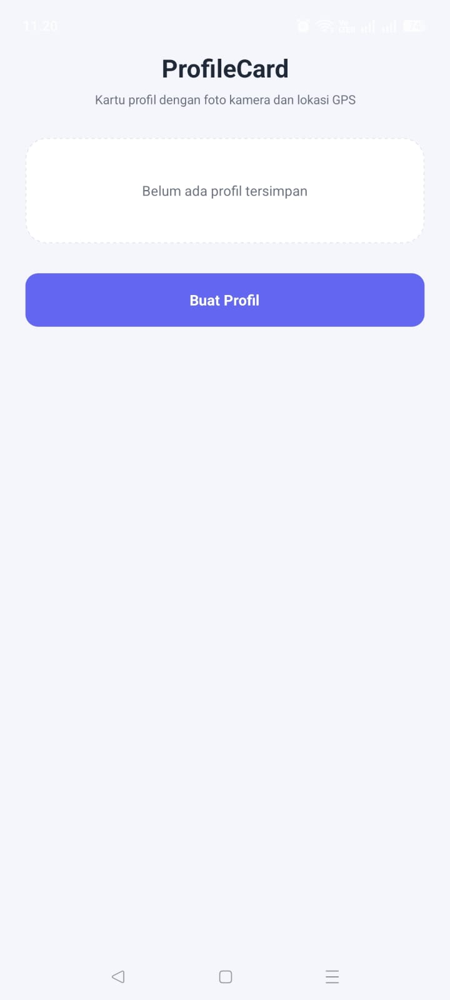
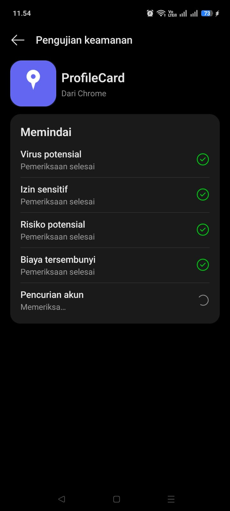
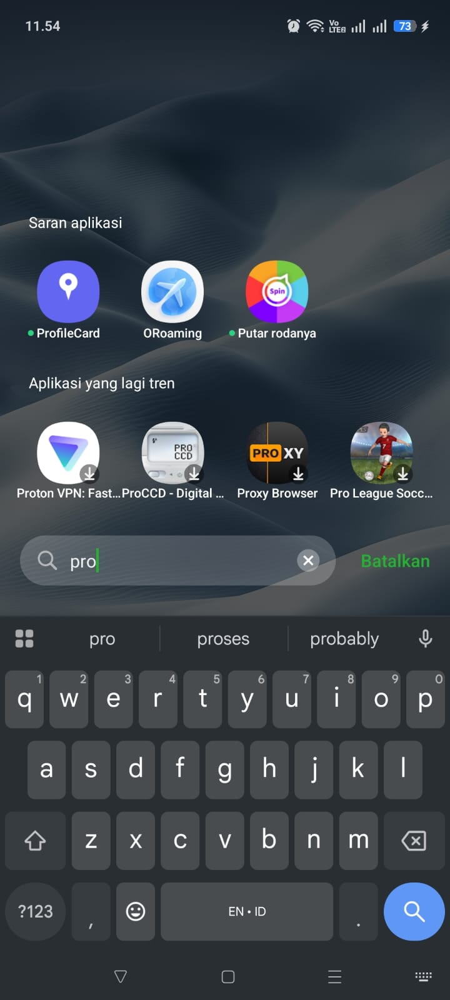
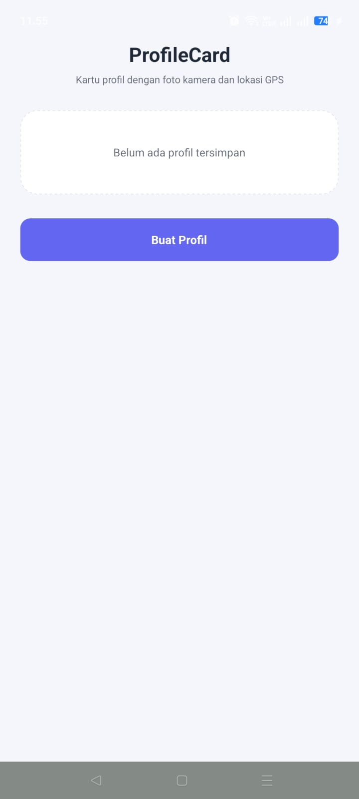

# 📇 ProfileCard


> **ProfileCard** adalah aplikasi kartu profil digital. Pengguna mengambil foto langsung dari kamera HP dan menangkap koordinat lokasi saat ini via GPS — keduanya digabung jadi satu kartu profil yang tersimpan otomatis di perangkat, bahkan setelah aplikasi ditutup total.

Dibuat sebagai submission untuk **Misi 14 — Menyiapkan Aplikasi untuk Rilis**, Mata Kuliah Pemrograman Mobile.

---

## 📸 Screenshots

### Fitur Aplikasi (via Expo Go)

| Home (kosong) | Form ProfileCard | Home (terisi) |
|:---:|:---:|:---:|
|  |  |  |

### Bukti Build & Instalasi APK

| Build FINISHED di EAS | Instalasi APK di HP | Icon di App Drawer | App Berjalan (tanpa Expo Go) |
|:---:|:---:|:---:|:---:|
|  |  |  |  |

---

## ✨ Fitur Utama

- 📷 **Ambil foto profil** langsung dari kamera (`expo-image-picker`), lengkap dengan penanganan izin ditolak
- 📍 **Ambil koordinat GPS saat ini** (`expo-location`), lengkap dengan penanganan izin ditolak
- ✅ **Validasi form** — nama minimal 3 karakter, foto wajib diambil sebelum kartu bisa disimpan
- 💾 **Persistensi lokal** dengan AsyncStorage — kartu profil tetap ada setelah app ditutup dan dibuka ulang
- 🧭 **2 screen** dengan Stack Navigation (Home ↔ Profil Saya)
- 🔖 **App version display** — versi aplikasi (dari `app.json`) terbaca otomatis lewat `expo-constants`

---

## 🛠️ Tech Stack

| Layer | Teknologi |
|-------|-----------|
| Framework | React Native 0.81 + Expo SDK 54 |
| Navigation | React Navigation v6 (Native Stack) |
| Storage | `@react-native-async-storage/async-storage` |
| Device Feature | `expo-image-picker` (kamera) + `expo-location` (GPS) |
| App Info | `expo-constants` |
| Build | EAS Build (Expo Application Services) |

---

## 📁 Struktur Folder

```
profile-card-app/
├── App.js
├── app.json
├── eas.json
├── package.json
├── index.js
├── babel.config.js
├── src/
│   ├── navigation/AppNavigator.js
│   ├── screens/
│   │   ├── HomeScreen.js
│   │   └── ProfileCardScreen.js
│   ├── services/storage.js
│   └── constants/colors.js
└── assets/
    ├── icon.png
    ├── adaptive-icon.png
    ├── splash.png
    └── screenshots/
```

---

## 🚀 Cara Menjalankan (Development)

```bash
git clone https://github.com/Juaan2005/profile-card-app.git
cd profile-card-app
npm install
npx expo start
```

Scan QR Code yang muncul dengan aplikasi **Expo Go** di HP (pastikan versi Expo Go kamu mendukung SDK 54).

---

## 📦 Download & Install APK

**[⬇️ Download APK (via EAS Dashboard)](https://expo.dev/accounts/juantambunan/projects/profile-card-app-juan/builds/0629336f-5a75-417a-87a4-c89765303b20))**

> ⚠️ Link build EAS tersimpan selama 30 hari. Jika link kadaluarsa, build ulang dengan `eas build --platform android --profile preview`.

**Cara install:**
1. Download file `.apk` di atas langsung dari HP Android
2. Buka file yang sudah terdownload
3. Izinkan instalasi dari sumber tidak dikenal jika diminta
4. Tap **Install**, tunggu selesai, lalu buka aplikasinya

---

## 🌐 Expo Snack

**[▶️ Coba versi interaktif di Expo Snack](LINK_EXPO_SNACK)**

---

## 🔧 Build dari Sumber (EAS)

```bash
eas login
eas init
eas build --platform android --profile preview
```

Konfigurasi build ada di `eas.json`, dengan profile `preview` menghasilkan `.apk` (internal distribution) dan profile `production` menghasilkan `.aab` untuk rilis Play Store.

---

## 👤 Developer

**Juan Tambunan**
Universitas Prima Indonesia — Prodi Sistem Informasi
Mata Kuliah: Pemrograman Mobile (TI-MOBILE-01)
GitHub: [@Juaan2005](https://github.com/Juaan2005)
